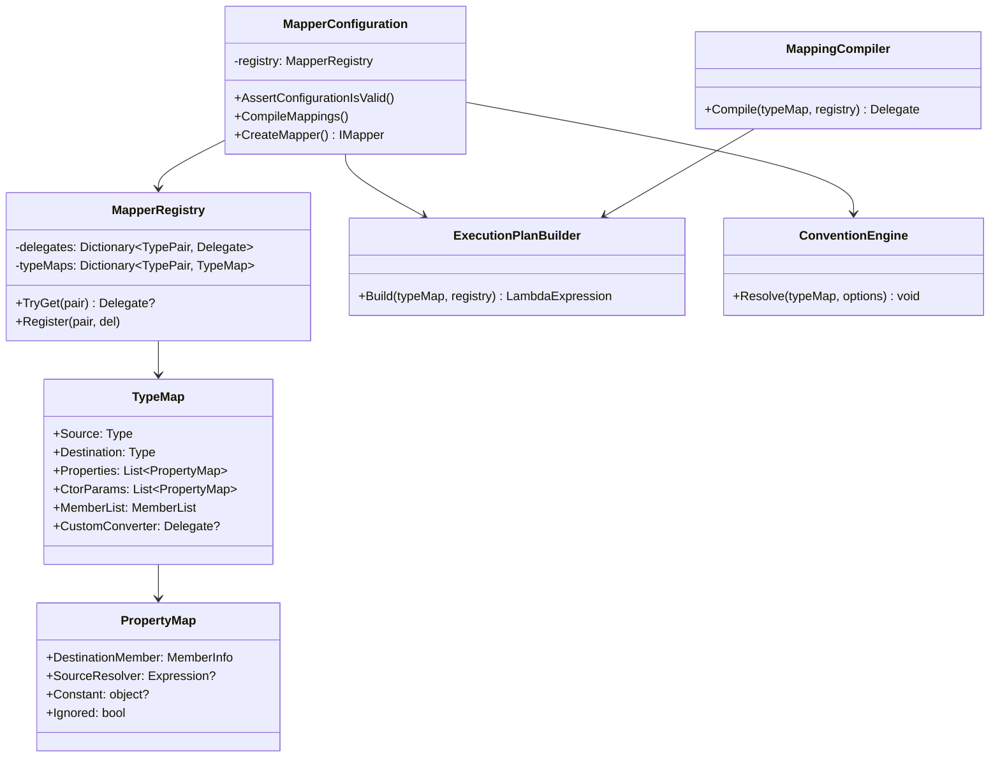

# Atlas v1 — Technical Design

> Implementation specification for Atlas, a fluent, runtime expression-tree-compiling object-to-object mapper for .NET 10+. This document is the single source of truth for a Claude implementation session. Read top-to-bottom; build test-first.

**Audience:** the implementing Claude session.
**Methodology:** strict TDD — every production line is preceded by a failing test from §10.
**Source spec:** `C:\Repos\Atlas\Object-Mapping-Functional-Reference.md`. Where this design and the reference disagree, this design wins.

---

## 1. Goals & Non-Goals

### 1.1 Goals (v1, in scope)
1. Fluent configuration API for declaring `Source → Destination` mappings.
2. Assembly scanning that discovers `MapperProfile` subclasses and registers their maps.
3. Convention-based name matching with PascalCase flattening.
4. Per-member overrides: `MapFrom(expression)`, `MapFrom(constant)`, `Ignore()`.
5. Per-constructor-parameter overrides for record / immutable destinations.
6. Custom type converters (`ITypeConverter<TSource, TDestination>`).
7. Collections (source `IEnumerable<T>` / `T[]` / `List<T>` → destination `List<T>` / `IList<T>` / `ICollection<T>` / `IEnumerable<T>` / `T[]`) and dictionaries (`Dictionary<K,V>` → `Dictionary<K,V>`).
8. New-instance and update-in-place mapping shapes.
9. Runtime configuration validation (`AssertConfigurationIsValid`) with structured error reporting.
10. Explicit eager compilation (`CompileMappings`) and automatic eager compile inside `AddAtlas`.
11. `Microsoft.Extensions.DependencyInjection` adapter shipping the `AddAtlas(...)` extension.
12. Defended performance posture: zero per-call reflection on the hot path; per-call allocation budget asserted by benchmark.
13. ≥90% line/branch coverage on the core, ≥85% on the DI adapter.

### 1.2 Non-Goals (v1, out of scope — these are tracked as task #16 follow-ups)
IQueryable projection, inheritance/polymorphism (`Include`/`IncludeBase`), enum surface beyond raw integer assignment, reverse mapping, before/after hooks, value transformers, conditional mapping (`Condition` / `PreCondition`), null substitution, open generics, dynamic / `ExpandoObject` mapping, reference handling for cycles, attribute-based configuration, expression translation (`UseAsDataSource`), Native AOT support, source-generator implementation.

If the implementer encounters a need that isn't in §1.1, **stop and surface it** rather than expanding scope.

---

## 2. Architecture Overview

```mermaid
flowchart TD
    Host[Host startup<br/>services.AddAtlas&lt;Marker&gt;]
    Scanner[ProfileScanner]
    Profiles[Discovered MapperProfile classes]
    Expr[MapperConfigurationExpression]
    Cfg[MapperConfiguration]
    Compiler[ExecutionPlanBuilder<br/>+ MappingCompiler]
    Registry[MapperRegistry<br/>Dictionary&lt;TypePair, Delegate&gt;]
    Mapper[IMapper facade]
    Caller[Application code<br/>mapper.Map&lt;TDest&gt;&#40;src&#41;]

    Host --> Scanner --> Profiles --> Expr --> Cfg
    Cfg --> Compiler --> Registry
    Cfg --> Mapper
    Caller --> Mapper --> Registry
```



### 2.1 Lifetime model
- `MapperConfiguration` — singleton. Construction is expensive (reflects over types, builds expression trees, JIT-compiles delegates). Construction is one-shot per process.
- `IMapper` — singleton. Stateless thin facade; holds a reference to the `MapperConfiguration`.
- `MapperProfile` instances — transient; instantiated once during configuration build, then discarded. Their public parameterless constructor is the only thing the framework calls.

### 2.2 Hot path
A call to `mapper.Map<TDestination>(source)` performs exactly:
1. One `Dictionary<TypePair, Delegate>` lookup keyed by `(source.GetType(), typeof(TDestination))`.
2. One delegate invocation: `((Func<TSource, TDestination>)delegate)(source)`.
3. The delegate body is the JIT-compiled C# equivalent of hand-written assignment code.

No reflection, no boxing of value-type sources (typed overloads), no dictionary allocations, no `try/catch`, no logging.

### 2.3 Cold path
`MapperConfiguration` construction:
1. Each profile constructor runs and registers `TypeMap` records via `CreateMap<S,D>()`.
2. After all profiles register, member resolution runs: for each `TypeMap`, the convention engine matches source members to destination members; explicit `ForMember` calls override.
3. `CompileMappings()` walks every `TypeMap`, builds an `Expression` tree via `ExecutionPlanBuilder`, calls `LambdaExpression.Compile()`, and inserts the resulting delegate into `MapperRegistry` keyed by the `TypePair`.

`AddAtlas` invokes (3) automatically at the end of registration; consumers who construct `MapperConfiguration` directly may opt to call `CompileMappings()` themselves or rely on lazy first-use compilation (also supported).

### 2.4 Allocation budget on the warm path

| Operation | Allocations |
|---|---|
| `Map<TDest>(source)` for a flat POCO destination | 1 (the destination object itself) |
| `Map<TDest>(source)` for a destination with N nested mapped objects | 1 + N |
| `Map<TDest>(source)` for a destination with a list of M items | 1 (destination) + 1 (list) + M (items) |
| `Map<TS,TD>(source, existingDestination)` | 0 baseline; nested mapped objects allocate as above only when the existing graph node is null |

Internal collections (the `MapperRegistry` dictionary, the cached delegates) are allocated **once per process** during configuration build, never per call.

---

## 3. Solution & Project Layout

### 3.1 Top-level layout

```
C:/Repos/Atlas/
├── Atlas.sln
├── Directory.Build.props
├── Directory.Packages.props
├── .editorconfig
├── .gitignore
├── global.json
├── LICENSE                              (existing)
├── README.md                            (created by implementer)
├── docs/
│   ├── Atlas-Design.md                  (this file)
│   ├── AutoMapper-Analysis.md           (existing reference)
│   ├── Mapperly-Analysis.md             (existing reference)
│   └── Object-Mapping-Functional-Reference.md (existing reference)
├── src/
│   ├── Atlas/
│   │   ├── Atlas.csproj
│   │   ├── IMapper.cs
│   │   ├── Mapper.cs
│   │   ├── MapperConfiguration.cs
│   │   ├── MapperConfigurationExpression.cs
│   │   ├── MapperProfile.cs
│   │   ├── ITypeConverter.cs
│   │   ├── MemberList.cs
│   │   ├── AtlasConfigurationException.cs
│   │   ├── Configuration/
│   │   │   ├── IMappingExpression.cs
│   │   │   ├── IMemberConfigurationExpression.cs
│   │   │   ├── MappingExpression.cs
│   │   │   └── MemberConfigurationExpression.cs
│   │   └── Internal/
│   │       ├── TypePair.cs
│   │       ├── TypeMap.cs
│   │       ├── PropertyMap.cs
│   │       ├── MapperRegistry.cs
│   │       ├── ExecutionPlanBuilder.cs
│   │       ├── MappingCompiler.cs
│   │       └── ConventionEngine.cs
│   └── Atlas.Extensions.DependencyInjection/
│       ├── Atlas.Extensions.DependencyInjection.csproj
│       ├── ServiceCollectionExtensions.cs
│       └── Internal/
│           └── ProfileScanner.cs
└── tests/
    ├── Atlas.Tests/
    │   ├── Atlas.Tests.csproj
    │   └── (test files per §10)
    └── Atlas.Benchmarks/
        ├── Atlas.Benchmarks.csproj
        └── (benchmark files per §11)
```

### 3.2 `Directory.Build.props`

```xml
<Project>
  <PropertyGroup>
    <TargetFramework>net10.0</TargetFramework>
    <LangVersion>preview</LangVersion>
    <Nullable>enable</Nullable>
    <ImplicitUsings>enable</ImplicitUsings>
    <TreatWarningsAsErrors>true</TreatWarningsAsErrors>
    <EnforceCodeStyleInBuild>true</EnforceCodeStyleInBuild>
    <Deterministic>true</Deterministic>
    <ContinuousIntegrationBuild Condition="'$(CI)' == 'true'">true</ContinuousIntegrationBuild>
    <GenerateDocumentationFile>true</GenerateDocumentationFile>
    <NoWarn>$(NoWarn);CS1591</NoWarn>
  </PropertyGroup>
</Project>
```

### 3.3 `Directory.Packages.props` (central package management)

```xml
<Project>
  <PropertyGroup>
    <ManagePackageVersionsCentrally>true</ManagePackageVersionsCentrally>
  </PropertyGroup>
  <ItemGroup>
    <PackageVersion Include="Microsoft.Extensions.DependencyInjection.Abstractions" Version="10.0.0" />
    <PackageVersion Include="xunit.v3" Version="3.0.0" />
    <PackageVersion Include="xunit.runner.visualstudio" Version="3.0.0" />
    <PackageVersion Include="Microsoft.NET.Test.Sdk" Version="17.12.0" />
    <PackageVersion Include="coverlet.collector" Version="6.0.2" />
    <PackageVersion Include="BenchmarkDotNet" Version="0.14.0" />
  </ItemGroup>
</Project>
```
Pin to currently-shipping versions when the implementer runs the work; the numbers above are illustrative.

### 3.4 `global.json`

```json
{
  "sdk": {
    "version": "10.0.100",
    "rollForward": "latestFeature"
  }
}
```

### 3.5 Per-project csproj snippets

`src/Atlas/Atlas.csproj`:
```xml
<Project Sdk="Microsoft.NET.Sdk">
  <PropertyGroup>
    <PackageId>Atlas</PackageId>
    <Description>A fluent, high-performance object-to-object mapper for .NET.</Description>
  </PropertyGroup>
  <ItemGroup>
    <InternalsVisibleTo Include="Atlas.Tests" />
    <InternalsVisibleTo Include="Atlas.Extensions.DependencyInjection" />
  </ItemGroup>
</Project>
```

`src/Atlas.Extensions.DependencyInjection/Atlas.Extensions.DependencyInjection.csproj`:
```xml
<Project Sdk="Microsoft.NET.Sdk">
  <PropertyGroup>
    <PackageId>Atlas.Extensions.DependencyInjection</PackageId>
  </PropertyGroup>
  <ItemGroup>
    <ProjectReference Include="..\Atlas\Atlas.csproj" />
    <PackageReference Include="Microsoft.Extensions.DependencyInjection.Abstractions" />
  </ItemGroup>
</Project>
```

`tests/Atlas.Tests/Atlas.Tests.csproj`:
```xml
<Project Sdk="Microsoft.NET.Sdk">
  <PropertyGroup>
    <IsPackable>false</IsPackable>
    <IsTestProject>true</IsTestProject>
  </PropertyGroup>
  <ItemGroup>
    <ProjectReference Include="..\..\src\Atlas\Atlas.csproj" />
    <ProjectReference Include="..\..\src\Atlas.Extensions.DependencyInjection\Atlas.Extensions.DependencyInjection.csproj" />
    <PackageReference Include="xunit.v3" />
    <PackageReference Include="xunit.runner.visualstudio" />
    <PackageReference Include="Microsoft.NET.Test.Sdk" />
    <PackageReference Include="coverlet.collector" />
  </ItemGroup>
</Project>
```

`tests/Atlas.Benchmarks/Atlas.Benchmarks.csproj`:
```xml
<Project Sdk="Microsoft.NET.Sdk">
  <PropertyGroup>
    <OutputType>Exe</OutputType>
    <IsPackable>false</IsPackable>
  </PropertyGroup>
  <ItemGroup>
    <ProjectReference Include="..\..\src\Atlas\Atlas.csproj" />
    <PackageReference Include="BenchmarkDotNet" />
  </ItemGroup>
</Project>
```

### 3.6 `.gitignore`
Use `dotnet new gitignore` in the repo root. No customization required.

### 3.7 `.editorconfig`
Use `dotnet new editorconfig` in the repo root, then add:
```
[*.cs]
csharp_style_namespace_declarations = file_scoped:error
csharp_using_directive_placement = outside_namespace:error
dotnet_diagnostic.CA1062.severity = none   # null guards on public APIs handled by NRT
```

---

## 4. Public API Surface

These are the exact public types and signatures the v1 implementation must produce. Internal types appear in §5.

### 4.1 `Atlas.IMapper`
```csharp
namespace Atlas;

public interface IMapper
{
    /// <summary>Map a source instance to a new destination of TDestination.</summary>
    TDestination Map<TDestination>(object source);

    /// <summary>Map a source of TSource to a new destination of TDestination.</summary>
    TDestination Map<TSource, TDestination>(TSource source);

    /// <summary>Map a source onto an existing destination instance (update in place).</summary>
    void Map<TSource, TDestination>(TSource source, TDestination destination);

    /// <summary>The configuration this mapper was built from. Exposed for projection in v2.</summary>
    MapperConfiguration ConfigurationProvider { get; }
}
```

### 4.2 `Atlas.MapperConfiguration`
```csharp
namespace Atlas;

public sealed class MapperConfiguration
{
    public MapperConfiguration(Action<MapperConfigurationExpression> configure);

    public MapperConfiguration(MapperConfigurationExpression expression);

    /// <summary>Validate that every type-map's destination members are accounted for.</summary>
    /// <exception cref="AtlasConfigurationException">If any unmapped destination member exists.</exception>
    public void AssertConfigurationIsValid();

    /// <summary>Build and cache the delegate for every registered TypeMap.</summary>
    public void CompileMappings();

    /// <summary>Create an IMapper bound to this configuration.</summary>
    public IMapper CreateMapper();
}
```

### 4.3 `Atlas.MapperConfigurationExpression`
```csharp
namespace Atlas;

public sealed class MapperConfigurationExpression
{
    /// <summary>Add a single profile by type. Profile must have a public parameterless constructor.</summary>
    public void AddProfile<TProfile>() where TProfile : MapperProfile, new();

    /// <summary>Add a profile instance.</summary>
    public void AddProfile(MapperProfile profile);

    /// <summary>Discover and add all non-abstract MapperProfile subclasses with a public parameterless ctor.</summary>
    public void AddMaps(params Assembly[] assemblies);

    /// <summary>Convenience: scan the assembly containing the given type.</summary>
    public void AddMaps<TMarker>();

    /// <summary>Inline map declaration (equivalent to a one-line profile).</summary>
    public IMappingExpression<TSource, TDestination> CreateMap<TSource, TDestination>(
        MemberList memberList = MemberList.Destination);

    /// <summary>Naming convention applied across all maps unless overridden.</summary>
    public NamingConvention SourceMemberNamingConvention { get; set; }
    public NamingConvention DestinationMemberNamingConvention { get; set; }

    /// <summary>Case sensitivity for member matching. Default: case-sensitive.</summary>
    public bool CaseSensitive { get; set; }
}
```

### 4.4 `Atlas.MapperProfile`
```csharp
namespace Atlas;

public abstract class MapperProfile
{
    protected IMappingExpression<TSource, TDestination> CreateMap<TSource, TDestination>(
        MemberList memberList = MemberList.Destination);

    public NamingConvention? SourceMemberNamingConvention { get; protected set; }
    public NamingConvention? DestinationMemberNamingConvention { get; protected set; }
    public bool? CaseSensitive { get; protected set; }
}
```

### 4.5 `Atlas.MemberList`
```csharp
namespace Atlas;

public enum MemberList
{
    /// <summary>Validate every destination member is mapped or explicitly ignored. (Default.)</summary>
    Destination,
    /// <summary>Validate every source member is consumed.</summary>
    Source,
    /// <summary>Skip validation for this map.</summary>
    None,
}
```

### 4.6 `Atlas.NamingConvention`
```csharp
namespace Atlas;

public enum NamingConvention
{
    PascalCase,
    CamelCase,
    SnakeCase,
}
```

### 4.7 `Atlas.ITypeConverter<TSource, TDestination>`
```csharp
namespace Atlas;

public interface ITypeConverter<in TSource, TDestination>
{
    TDestination Convert(TSource source, TDestination? destination);
}
```

### 4.8 `Atlas.Configuration.IMappingExpression<TSource, TDestination>`
```csharp
namespace Atlas.Configuration;

public interface IMappingExpression<TSource, TDestination>
{
    IMappingExpression<TSource, TDestination> ForMember<TMember>(
        Expression<Func<TDestination, TMember>> destinationMember,
        Action<IMemberConfigurationExpression<TSource, TDestination, TMember>> memberOptions);

    IMappingExpression<TSource, TDestination> ForCtorParam(
        string ctorParamName,
        Action<IMemberConfigurationExpression<TSource, TDestination, object?>> paramOptions);

    /// <summary>Use a globally-registered ITypeConverter. The converter type must be DI-resolvable
    /// (parameterless constructor in v1).</summary>
    void ConvertUsing<TConverter>() where TConverter : ITypeConverter<TSource, TDestination>, new();

    /// <summary>Use an inline conversion delegate.</summary>
    void ConvertUsing(Func<TSource, TDestination> converter);
}
```

### 4.9 `Atlas.Configuration.IMemberConfigurationExpression<TSource, TDestination, TMember>`
```csharp
namespace Atlas.Configuration;

public interface IMemberConfigurationExpression<TSource, TDestination, TMember>
{
    /// <summary>Map this destination member from an arbitrary expression on the source.</summary>
    void MapFrom<TSourceMember>(Expression<Func<TSource, TSourceMember>> sourceMember);

    /// <summary>Map this destination member from a constant value.</summary>
    void MapFrom(TMember constantValue);

    /// <summary>Skip this destination member entirely (also removes it from validation).</summary>
    void Ignore();
}
```

### 4.10 `Atlas.AtlasConfigurationException`
```csharp
namespace Atlas;

public sealed class AtlasConfigurationException : Exception
{
    public IReadOnlyList<ConfigurationError> Errors { get; }

    public AtlasConfigurationException(IReadOnlyList<ConfigurationError> errors);
}

public sealed record ConfigurationError(
    Type SourceType,
    Type DestinationType,
    string DestinationMemberName,
    string Reason);
```
The `Message` property must be a multi-line summary listing every error in the form `{SourceType.Name} -> {DestinationType.Name}.{Member}: {Reason}` so a developer can fix every problem from a single test run.

### 4.11 `Atlas.Extensions.DependencyInjection.ServiceCollectionExtensions`
```csharp
namespace Microsoft.Extensions.DependencyInjection;

public static class AtlasServiceCollectionExtensions
{
    /// <summary>Scan the assembly containing TMarker for profiles, register Atlas.</summary>
    public static IServiceCollection AddAtlas<TMarker>(this IServiceCollection services);

    /// <summary>Scan the supplied assemblies for profiles, register Atlas.</summary>
    public static IServiceCollection AddAtlas(
        this IServiceCollection services,
        params Assembly[] assemblies);

    /// <summary>Scan the supplied assemblies; allow inline configuration before profiles run.</summary>
    public static IServiceCollection AddAtlas(
        this IServiceCollection services,
        Action<MapperConfigurationExpression> configure,
        params Assembly[] assemblies);
}
```

Behavior, common to all overloads:
1. Build a `MapperConfigurationExpression`.
2. Apply the optional inline `configure` callback first.
3. Invoke the scanner to add discovered profiles.
4. Materialize a `MapperConfiguration`.
5. Call `CompileMappings()`.
6. Register `MapperConfiguration` as singleton.
7. Register `IMapper` as singleton (resolved via `cfg.CreateMapper()`).

If any step throws, the exception bubbles — registration must fail fast at startup.

---

## 5. Internal Architecture

### 5.1 Component diagram



### 5.2 `TypePair`
```csharp
internal readonly record struct TypePair(Type Source, Type Destination);
```
Value type; `Equals`/`GetHashCode` from the record. Used as the dictionary key in `MapperRegistry`. The hot path equality comparison must not allocate.

### 5.3 `TypeMap`
Holds the configured shape for one `(Source, Destination)` pair. Mutable during configuration build, frozen afterward (a `Sealed` flag enforces this; mutating after seal throws `InvalidOperationException`).

### 5.4 `PropertyMap`
One per destination member. Three mutually-exclusive states: source-resolved (carries an `Expression`), constant (carries a value), ignored. Convention matching produces source-resolved `PropertyMap`s; `ForMember` may overwrite or upgrade them.

### 5.5 `MapperRegistry`
Two dictionaries:
- `Dictionary<TypePair, TypeMap>` — populated during configuration build.
- `Dictionary<TypePair, Delegate>` — populated by `CompileMappings`; this is the hot-path lookup.

Both dictionaries are populated under a build-time lock; after `MapperConfiguration` construction returns, both are read-only (the configuration itself is immutable).

### 5.6 `ConventionEngine`
For each `TypeMap`, walks the destination type's writable members and finds a corresponding source member (or member chain, via flattening). Algorithm in §6.

### 5.7 `ExecutionPlanBuilder`
Produces a `LambdaExpression` that, when compiled and invoked, performs the entire map. Algorithm in §7.

### 5.8 `MappingCompiler`
Thin wrapper around `ExecutionPlanBuilder` + `Expression.Compile()`. Exists as a seam for testing (so a test can intercept the compile call) and for any future caching strategies.

---

## 6. Convention Engine

### 6.1 Inputs
- The destination type's public, writable instance properties.
- The source type's public, readable instance properties (and read-only fields for record positional parameters).
- The map-level configuration: case sensitivity, naming conventions for both sides.

### 6.2 Match algorithm (per destination member)

```
input: destination member D
1. Compute D's "logical name" by translating from the destination naming convention to PascalCase (the canonical internal form). E.g. snake_case "customer_name" → "CustomerName".

2. Try direct match: find a source member whose translated logical name equals D's logical name (using StringComparer.Ordinal or OrdinalIgnoreCase per CaseSensitive).

3. If no direct match, try flattening: split D's logical name into capitalized segments ["Customer", "Name"]. Walk the source: source.Customer.Name. If the chain resolves and the leaf type is assignment-compatible (or a registered map exists), accept it.

4. If still no match, leave the PropertyMap unresolved — validation (§8) will surface it later.
```

### 6.3 Naming convention translation

| Convention | Examples | Canonical PascalCase |
|---|---|---|
| `PascalCase` | `CustomerName` | `CustomerName` |
| `CamelCase` | `customerName` | `CustomerName` |
| `SnakeCase` | `customer_name` | `CustomerName` |

Translation is a pure function over strings — no reflection involved. Implement in `ConventionEngine` as a private static helper; unit-test it independently per §10.

### 6.4 Worked examples

| Source member | Destination member | Match path |
|---|---|---|
| `Order.Total` | `OrderDto.Total` | direct |
| `Order.Customer.Name` | `OrderDto.CustomerName` | flattening |
| `order.customer_email` (snake_case source) | `OrderDto.CustomerEmail` (PascalCase dest) | naming-translation, then direct |
| `Order.Total` | `OrderDto.GrandTotal` | no match → unresolved → validation error |

### 6.5 Out of scope for v1 conventions
- Method matching with `Get` prefix stripping (v2).
- Substring replacement (v2).
- `IncludeMembers` controlled flattening (v2).

### 6.6 Member visibility rules (v1)
- Map only **public, instance** properties on both sides.
- Skip indexers.
- Skip properties whose getter (source) or setter (destination) is non-public.
- Init-only and `required` setters count as writable.
- Fields are not mapped in v1.

---

## 7. Expression Compilation

### 7.1 Overall lambda shape

For a non-collection map `Source → Destination` with N member mappings, the generated expression resembles:

```csharp
(Source src) =>
{
    var dest = new Destination();          // or new Destination(ctorParams...)
    if (src == null) return dest;
    dest.Member1 = <expr-for-member-1>;
    dest.Member2 = <expr-for-member-2>;
    ...
    return dest;
};
```

Compiled to `Func<Source, Destination>` and registered against `TypePair(Source, Destination)`.

For the update-in-place overload `Map<TS,TD>(TS, TD)`:

```csharp
(Source src, Destination dest) =>
{
    if (src == null) return;
    dest.Member1 = <expr-for-member-1>;
    ...
};
```

Compiled to `Action<Source, Destination>` and registered against the same `TypePair` in a parallel "update" dictionary.

### 7.2 Per-`PropertyMap` expression generation

| `PropertyMap` shape | Emitted expression for `<expr-for-member-N>` |
|---|---|
| Source-resolved direct member | `src.PropertyName` |
| Source-resolved flattened path | `src.Customer == null ? default(TLeaf) : src.Customer.Name` (null-safe walk) |
| Custom `MapFrom(expression)` | the expression body, parameter-substituted to `src` |
| Constant `MapFrom(value)` | `Expression.Constant(value, typeof(TMember))` |
| Ignored | property is omitted from the lambda body |
| Member type requires nested mapping | `_registry.GetTypedDelegate<TS,TD>().Invoke(<source-expr>)` — nested invocation goes through the registry, *not* recursive expression inlining (keeps lambdas finite even on deep graphs) |
| Member type has a custom `ITypeConverter` | inline `new TConverter().Convert(<source-expr>, default)` — converters are guaranteed cheap to instantiate (parameterless ctor) |

### 7.3 Constructor mapping
If the destination has no parameterless constructor:
1. Choose a constructor (v1 rule: prefer the constructor with the most parameters; if tied, the first declared).
2. For each constructor parameter, look up a `PropertyMap` registered via `ForCtorParam(name, ...)` first; otherwise fall back to convention matching against the parameter name (case-insensitive on the parameter name itself, regardless of `CaseSensitive` setting — parameter names are conventionally camelCase).
3. Emit `Expression.New(ctorInfo, ctorArgExpressions)` instead of the parameterless `new` plus property assignments. Properties matched by the convention engine that are *not* covered by the constructor still get post-construction property-set blocks (records permit this for any `init` properties beyond positional ones).

### 7.4 Collections

The implementer must handle two source/destination collection shapes:

**Sequence-to-sequence** (any `IEnumerable<TSource>` → any of `List<TDest>`, `IList<TDest>`, `ICollection<TDest>`, `IEnumerable<TDest>`, `TDest[]`):

For destination `List<TDest>` / `IList<TDest>` / `ICollection<TDest>` / `IEnumerable<TDest>`:
```csharp
(IEnumerable<TSource> src) =>
{
    if (src is null) return new List<TDest>(0);   // null-becomes-empty (v1 default)
    var list = new List<TDest>(src is ICollection<TSource> c ? c.Count : 4);
    foreach (var item in src) list.Add(<item-mapping-expression>);
    return list;
};
```

For destination `TDest[]`:
```csharp
(IEnumerable<TSource> src) =>
{
    if (src is null) return Array.Empty<TDest>();
    if (src is ICollection<TSource> c)
    {
        var arr = new TDest[c.Count];
        var i = 0;
        foreach (var item in src) arr[i++] = <item-mapping-expression>;
        return arr;
    }
    var list = new List<TDest>();
    foreach (var item in src) list.Add(<item-mapping-expression>);
    return list.ToArray();
};
```

**Dictionary-to-dictionary** (`Dictionary<KS,VS>` → `Dictionary<KD,VD>`):
```csharp
(Dictionary<KS,VS> src) =>
{
    if (src is null) return new Dictionary<KD,VD>();
    var dict = new Dictionary<KD,VD>(src.Count);
    foreach (var kv in src) dict[<key-map>] = <value-map>;
    return dict;
};
```
Key and value mappings each go through the registry (or are direct assignments when types match).

`<item-mapping-expression>` is the registry lookup form from §7.2 row 6.

### 7.5 Null-source policy (v1)
- Reference-typed source on the entry point: returns `default(TDestination)` (or for collections, an empty destination collection per §7.4).
- Reference-typed source member on a flattened path: yields `default(TLeaf)` (null-coalesce at each step of the walk).
- Update-in-place with a null source is a **no-op** (no exception, no mutation).

### 7.6 Cycle detection
Out of scope for v1 (reference handling is a v2 feature). Document the limitation in the README; if a user maps a cyclic graph, they get a `StackOverflowException`. Calling this out is sufficient for v1.

### 7.7 Compilation invocation
```csharp
var lambda = ExecutionPlanBuilder.Build(typeMap, registry);   // LambdaExpression
var del    = lambda.Compile();                                 // Delegate
registry.Register(typeMap.Pair, del);
```
`CompileMappings()` iterates every registered `TypeMap` and runs the above. Lazy (first-use) compilation is also supported: `IMapper.Map<>` falls through a missing-delegate case to `MappingCompiler.Compile(typeMap, registry)` and inserts before invoking. The lazy path is internally synchronized with a `Lock` (.NET 9+ `System.Threading.Lock`) per `TypePair` to prevent duplicate compiles under concurrency.

---

## 8. Validation

### 8.1 `AssertConfigurationIsValid` algorithm

```
input: MapperConfiguration cfg
output: throws AtlasConfigurationException with all errors, or returns silently

1. errors = []
2. For each TypeMap tm in cfg.Registry where tm.MemberList != None:
   a. If tm.MemberList == Destination:
      - For each public-writable property D on tm.Destination:
        - If no PropertyMap exists for D: add error
        - Else if PropertyMap is unresolved (no source, no constant, not ignored): add error
        - Else if PropertyMap is source-resolved and the source/destination types
          require a nested map but no TypeMap exists for that pair AND no
          ITypeConverter is registered AND the assignment is not implicitly
          legal: add error
   b. If tm.MemberList == Source:
      - mirror image: every public-readable source property must be consumed by
        either a PropertyMap or an explicit Ignore on the source side.
3. If errors.Count > 0: throw AtlasConfigurationException(errors).
```

### 8.2 What "implicitly legal" means
- Identical types.
- Implicit reference conversion (derived → base).
- Built-in numeric widening conversions (`int` → `long`, etc.) where C# would compile the assignment without a cast.
- A registered `ITypeConverter<TS, TD>`.
- A registered nested `TypeMap`.

Any other assignment is an error and validation must catch it.

### 8.3 Validation timing
- `AssertConfigurationIsValid` is **not** called automatically. The implementer documents in the README that consumers should call it from a unit test.
- Validation does **not** invoke `CompileMappings`. Validation works on the `TypeMap`/`PropertyMap` data model alone, so it can run on a fresh, uncompiled configuration.

---

## 9. Dependency Injection Extension

### 9.1 `AddAtlas` overloads (defined in §4.11)

### 9.2 Profile scanner algorithm

```
input: Assembly[] assemblies
output: IEnumerable<MapperProfile>

1. distinct = assemblies.Distinct() — guard against double-scanning
2. For each assembly:
     For each type T in assembly.GetTypes() where:
       - T is a class
       - T is not abstract
       - T is assignable to MapperProfile
       - T has a public parameterless constructor
     yield (MapperProfile)Activator.CreateInstance(T)!
```
Types that satisfy the first three conditions but **not** the constructor condition cause the scanner to throw an `AtlasConfigurationException` with reason "Profile {TypeName} requires a public parameterless constructor". This is louder than skipping silently — fail fast.

### 9.3 Registration shape

```csharp
public static IServiceCollection AddAtlas(
    this IServiceCollection services,
    Action<MapperConfigurationExpression> configure,
    params Assembly[] assemblies)
{
    var expr = new MapperConfigurationExpression();
    configure?.Invoke(expr);
    foreach (var p in ProfileScanner.Discover(assemblies))
        expr.AddProfile(p);

    var cfg = new MapperConfiguration(expr);
    cfg.CompileMappings();

    services.AddSingleton(cfg);
    services.AddSingleton<IMapper>(_ => cfg.CreateMapper());
    return services;
}
```

### 9.4 Lifetimes
| Service | Lifetime | Reasoning |
|---|---|---|
| `MapperConfiguration` | Singleton | Immutable after build; expensive to build. |
| `IMapper` | Singleton | Stateless facade. |

### 9.5 Idempotency
Calling `AddAtlas` twice in the same `IServiceCollection` is undefined v1 behavior (the second call wins for the singleton registration). Document but do not defend against it.

---

## 10. TDD Plan

This section is the heart of the doc. The implementer creates each test file in the order listed, writes each test as failing first, then writes the minimum production code to make it pass, then refactors. Coverage targets in §12 will be naturally hit if every test below is implemented.

Test naming convention: `MethodOrFeature_Condition_ExpectedResult`. xUnit v3 `[Fact]` for unconditional, `[Theory]` + `[InlineData]` for parameterized.

### 10.1 `TypePairTests.cs` (~6 tests)
1. `Equals_SameTypes_ReturnsTrue`
2. `Equals_DifferentSource_ReturnsFalse`
3. `Equals_DifferentDestination_ReturnsFalse`
4. `GetHashCode_SamePair_IsStable`
5. `GetHashCode_DifferentPairs_DifferProbabilistically` (Theory: at least 95% distinct hashes across 100 random pairs)
6. `Pair_IsValueType` (sanity guard against accidental refactor to class)

### 10.2 `ConventionEngineTests.cs` (~12 tests)
1. `DirectMatch_SameNameSameType_Resolves`
2. `DirectMatch_DifferentTypes_LeavesUnresolved`
3. `Flattening_TwoLevels_Resolves` (`Customer.Name` → `CustomerName`)
4. `Flattening_ThreeLevels_Resolves` (`Customer.Address.City` → `CustomerAddressCity`)
5. `NamingConvention_SnakeSourceToPascalDest_Resolves`
6. `NamingConvention_PascalSourceToCamelDest_Resolves`
7. `CaseSensitive_LowerToUpper_DoesNotResolve`
8. `CaseInsensitive_LowerToUpper_Resolves`
9. `Indexer_OnSource_IsSkipped`
10. `PrivateGetter_OnSource_IsSkipped`
11. `InitOnlySetter_OnDestination_CountsAsWritable`
12. `RequiredProperty_OnDestination_CountsAsWritable`

### 10.3 `MapperConfigurationExpressionTests.cs` (~8 tests)
1. `CreateMap_SimpleType_RegistersTypeMap`
2. `CreateMap_Twice_ReplacesPreviousMap`
3. `AddProfile_Generic_InvokesProfileConstructor`
4. `AddProfile_Instance_RegistersProfileMaps`
5. `AddMaps_AssemblyMarker_DiscoversProfiles`
6. `AddMaps_AssemblyArray_DistinctAssemblies`
7. `AddMaps_ProfileWithoutPublicCtor_Throws`
8. `Defaults_CaseSensitiveTrue_PascalCaseBothSides`

### 10.4 `MappingExpressionTests.cs` (~10 tests)
1. `ForMember_MapFromExpression_PropertyMapHasExpression`
2. `ForMember_MapFromConstant_PropertyMapHasConstant`
3. `ForMember_Ignore_PropertyMapIsIgnored`
4. `ForMember_OnUnknownDestinationMember_Throws` (compile-safe; surfaced via expression analysis)
5. `ForCtorParam_NamedParam_RegistersCtorMap`
6. `ConvertUsing_Generic_RegistersConverter`
7. `ConvertUsing_Lambda_RegistersConverter`
8. `ConvertUsing_AndForMember_OnSameMap_LastWins` (or throws — implementer picks; document the choice)
9. `ForMember_MultipleCallsForSameMember_ReplacesPrevious`
10. `Builder_AfterMapSealed_Throws`

### 10.5 `ExecutionPlanBuilderTests.cs` (~10 tests)
These tests inspect the produced `LambdaExpression` (use `BuildExecutionPlan` exposed via `internal`), not its compiled form.
1. `FlatPoco_SingleProperty_ProducesAssignment`
2. `FlatPoco_NullSource_LambdaReturnsDefault`
3. `Flattened_TwoLevels_LambdaContainsNullCheck`
4. `Constant_MapFrom_ProducesConstantExpression`
5. `Ignored_PropertyOmittedFromLambda`
6. `NestedMap_GoesThroughRegistry_NotInlinedRecursively` (verify the expression includes a method call into the registry, not nested `New`)
7. `Collection_ListSource_ListDestination_ProducesForEach`
8. `Collection_NullSource_ProducesEmptyList`
9. `Collection_ArrayDestination_PreallocatesWhenSourceIsICollection`
10. `Constructor_ParameterizedDestination_UsesNewExpressionWithCtor`

### 10.6 `MapperConfigurationTests.cs` (~8 tests)
1. `CompileMappings_RegistersDelegateForEveryTypeMap`
2. `CompileMappings_Twice_IsIdempotent`
3. `CreateMapper_ReturnsNonNull`
4. `CreateMapper_SameInstanceOnSecondCall` (or new instance, choose; document)
5. `Configuration_AfterBuild_IsImmutable_AddingMapThrows`
6. `LazyCompilation_FirstMapCall_CompilesOnDemand`
7. `LazyCompilation_ConcurrentCalls_CompileOnce` (parallelize 100 calls; mock or count compiler invocations once via internal seam)
8. `ConfigurationProvider_OnMapper_ReturnsOriginalConfig`

### 10.7 `MapperTests.cs` — end-to-end happy-path (~14 tests)
1. `Map_FlatPocoToFlatPoco_AllPropertiesMapped`
2. `Map_NullSource_ReturnsDefault`
3. `Map_NestedObject_NestedMapApplied`
4. `Map_TwoLevelFlattening_DestinationIsCorrect`
5. `Map_NamingConventionTranslation_DestinationIsCorrect`
6. `Map_CustomTypeConverter_AppliedGlobally` (`Map<string, int>` via converter)
7. `Map_ConstantMapFrom_DestinationHasConstantValue`
8. `Map_IgnoredMember_KeepsDestinationDefault`
9. `Map_ListSourceToListDestination_ItemsMappedRecursively`
10. `Map_ListSourceToArrayDestination_LengthMatches`
11. `Map_DictionarySourceToDestination_KeysAndValuesMapped`
12. `Map_RecordDestination_ConstructorBindingByName`
13. `Map_UpdateInPlace_NullSource_IsNoOp`
14. `Map_UpdateInPlace_OverwritesScalarsKeepsUntouchedReferences`

### 10.8 `ValidationTests.cs` (~10 tests)
1. `AssertConfigurationIsValid_AllMembersMapped_ReturnsSilently`
2. `AssertConfigurationIsValid_UnmappedDestinationMember_Throws`
3. `AssertConfigurationIsValid_ExceptionListsAllErrors_NotJustFirst`
4. `AssertConfigurationIsValid_ExplicitIgnore_PassesValidation`
5. `AssertConfigurationIsValid_MemberListNone_SkipsCheck`
6. `AssertConfigurationIsValid_MemberListSource_UnconsumedSourceMember_Throws`
7. `AssertConfigurationIsValid_NestedMapMissing_SurfacedAsError`
8. `AssertConfigurationIsValid_TypeConverterPresent_ValidationPasses`
9. `AssertConfigurationIsValid_ImplicitNumericConversion_ValidationPasses`
10. `AssertConfigurationIsValid_ExceptionMessageFormat_HasOneLinePerError`

### 10.9 `AddAtlasExtensionTests.cs` (~10 tests, in `Atlas.Tests`)
1. `AddAtlas_RegistersIMapperAsSingleton`
2. `AddAtlas_RegistersMapperConfigurationAsSingleton`
3. `AddAtlas_TwoCallsToProvider_ReturnSameMapperInstance`
4. `AddAtlas_DiscoversProfilesInMarkerAssembly`
5. `AddAtlas_ConfigCallback_RunsBeforeProfileScan`
6. `AddAtlas_NoAssemblies_StillRegistersEmptyMapper`
7. `AddAtlas_DistinctAssemblies_NoDoubleRegistration`
8. `AddAtlas_ProfileMissingPublicCtor_ThrowsAtRegistration`
9. `AddAtlas_AfterAdded_AssertConfigurationIsValid_Passes`
10. `AddAtlas_TypeConverterRegisteredInProfile_AppliedAtRuntime`

**Total: ~88 tests across 9 files.** Implementer follows file order top-to-bottom; lower files generally depend on production code that earlier tests forced into existence.

---

## 11. Benchmark Plan

### 11.1 Three benchmark classes

`tests/Atlas.Benchmarks/ColdCallBenchmarks.cs` — measures the configuration-build + first-call latency. Baseline scenario establishes the floor for "expensive but one-shot" startup work.

`tests/Atlas.Benchmarks/WarmCallBenchmarks.cs` — measures per-call cost after compilation. Three scenarios:
1. Flat POCO with 5 string properties.
2. Nested object with 3 levels.
3. List of 100 items.

For each: report `Mean`, `StdDev`, `Allocated`. The "Allocated" column is the load-bearing metric — it must match §2.4's allocation budget.

`tests/Atlas.Benchmarks/ConfigBuildBenchmarks.cs` — measures `MapperConfiguration` construction + `CompileMappings` for 10, 100, 1000 registered maps. Confirms construction stays sub-linear on map count (via dictionary, not list, lookups during build).

### 11.2 Baseline expectations (initial regression budget)

| Benchmark | Mean | Allocated |
|---|---|---|
| `WarmCall_FlatPoco_5Strings` | < 200 ns | 1 alloc (the destination) |
| `WarmCall_Nested_3Levels` | < 600 ns | 1 + 2 = 3 allocs |
| `WarmCall_List_100Items` | < 15 µs | 1 (list) + 100 (items) = 101 allocs |
| `ConfigBuild_100Maps_FromCold` | < 50 ms | (no per-map budget) |

Adjust on first measurement; the value of the table is the **regression bound** — every subsequent change must stay within the established envelope.

### 11.3 CI integration
A separate workflow job invokes `dotnet run -c Release --project tests/Atlas.Benchmarks -- --filter '*' --exporters json` and uploads results as an artifact. v1 does not auto-fail on regression (no historical baseline yet); after the first three runs, add a comparison step that fails if any benchmark exceeds its baseline by >15%.

---

## 12. Coverage Targets

### 12.1 Targets
| Project | Line | Branch |
|---|---|---|
| `Atlas` | ≥ 90% | ≥ 85% |
| `Atlas.Extensions.DependencyInjection` | ≥ 85% | ≥ 80% |

### 12.2 Tooling
- `coverlet.collector` runs as part of `dotnet test --collect:"XPlat Code Coverage"`.
- `ReportGenerator` (CLI tool) renders the `.cobertura.xml` into HTML.

### 12.3 Coverage exclusions
- `[ExcludeFromCodeCoverage]` on:
  - `AtlasConfigurationException` boilerplate constructors (the message-formatting helper is covered by §10.8/10).
  - `Internal/MappingCompiler.Compile` thin pass-through (its callers are covered).
- Generated source (none in v1; this is a runtime library).

### 12.4 CI gate
The test job runs `dotnet test` with the coverage collector; the workflow then runs ReportGenerator and asserts the threshold via a step that exits non-zero if coverage is below target. Implementation: a small PowerShell or shell script the implementer commits under `build/check-coverage.ps1`.

---

## 13. Build & Tooling

### 13.1 Local commands the implementer must verify work end-to-end
```
dotnet restore
dotnet build -c Release
dotnet test  -c Release --collect:"XPlat Code Coverage"
dotnet run   -c Release --project tests/Atlas.Benchmarks
```

### 13.2 Package layout for `dotnet pack`
- `src/Atlas/Atlas.csproj` → `Atlas.nupkg`
- `src/Atlas.Extensions.DependencyInjection/...csproj` → `Atlas.Extensions.DependencyInjection.nupkg`

Both packages set `<GeneratePackageOnBuild>false</GeneratePackageOnBuild>`; CI runs `dotnet pack` explicitly.

### 13.3 GitHub Actions workflow (stub)
`.github/workflows/ci.yml`:
```yaml
name: CI
on:
  push: { branches: [main] }
  pull_request: { branches: [main] }
jobs:
  build-test:
    runs-on: ubuntu-latest
    steps:
      - uses: actions/checkout@v4
      - uses: actions/setup-dotnet@v4
        with:
          dotnet-version: '10.0.x'
      - run: dotnet restore
      - run: dotnet build -c Release --no-restore
      - run: dotnet test -c Release --no-build --collect:"XPlat Code Coverage"
      - run: ./build/check-coverage.ps1
        shell: pwsh
  benchmarks:
    runs-on: ubuntu-latest
    needs: build-test
    if: github.ref == 'refs/heads/main'
    steps:
      - uses: actions/checkout@v4
      - uses: actions/setup-dotnet@v4
        with: { dotnet-version: '10.0.x' }
      - run: dotnet run -c Release --project tests/Atlas.Benchmarks -- --filter '*' --exporters json
      - uses: actions/upload-artifact@v4
        with:
          name: benchmark-results
          path: BenchmarkDotNet.Artifacts/results/
```

### 13.4 Code style
`dotnet format` runs in CI as a separate non-blocking step in v1; promote to blocking after the codebase stabilizes.

---

## 14. Risks & Open Questions

The implementing session may encounter these and should pause to surface (not silently solve) them:

1. **Expression-tree depth on deeply nested POCOs.** §7 specifies that nested maps go through the registry rather than expression-inlined. If the implementer finds a perf reason to inline shallow nested maps (1–2 levels deep), that's a defensible micro-optimization but should be measured before being adopted.

2. **`ITypeConverter` instance lifetime.** v1 says "parameterless `new`". If a converter genuinely needs DI, that's a v2 feature (DI-resolved converters, akin to AutoMapper's `ConstructServicesUsing`). Don't sneak in `IServiceProvider` plumbing in v1.

3. **Update-in-place for collection destinations.** §7 spec covers new-instance collection mapping. Update-in-place onto an existing `List<T>` (clear + add? merge by index?) is **deferred** — emit `NotImplementedException` and document. The TDD plan does not include this scenario.

4. **`record class` vs `record struct` destinations.** v1 must support `record class`; `record struct` is a stretch goal. If `record struct` complicates expression generation, document the limitation and skip — add tests for it in v2.

5. **Configuration immutability after build.** The design says `MapperConfigurationExpression` cannot be mutated after `MapperConfiguration` is constructed. Verify there's no leak via `MapperProfile` instances retaining a reference to the expression after build.

6. **Reflection access in .NET 10 trimming.** Even though AOT is out of scope, .NET 10 may surface trimming warnings during build (since the library uses reflection on user types). If warnings appear, suppress with the appropriate `[RequiresUnreferencedCode]` annotations on the public API surface and document; do not attempt to fix.

7. **`Lock` vs `object` for synchronization.** §7.7 specifies `System.Threading.Lock` (.NET 9+). Confirm available in .NET 10 SDK at implementation time; fall back to `object` if not.

---

## 15. Appendix A — Worked Example

A single end-to-end mapping, traced from configuration through compilation to execution. The implementer should be able to point at any output of the framework and identify which of these stages produced it.

### 15.1 Domain types
```csharp
public class Order
{
    public int Id { get; set; }
    public decimal Total { get; set; }
    public Customer Customer { get; set; } = null!;
}

public class Customer
{
    public string Name { get; set; } = "";
}

public class OrderDto
{
    public int Id { get; set; }
    public string OrderNumber { get; set; } = "";
    public decimal Total { get; set; }
    public string CustomerName { get; set; } = "";
}
```

### 15.2 Profile
```csharp
public sealed class OrderProfile : MapperProfile
{
    public OrderProfile()
    {
        CreateMap<Order, OrderDto>()
            .ForMember(d => d.OrderNumber, o => o.MapFrom(s => $"ORD-{s.Id:D6}"));
        // Id, Total, CustomerName all resolved by convention (CustomerName via flattening).
    }
}
```

### 15.3 Resulting `TypeMap` (post-resolution, conceptual)

| Destination member | `PropertyMap` contents |
|---|---|
| `Id` | source-resolved: `s => s.Id` |
| `OrderNumber` | source-resolved (custom): `s => $"ORD-{s.Id:D6}"` |
| `Total` | source-resolved: `s => s.Total` |
| `CustomerName` | source-resolved (flattened): `s => s.Customer == null ? null : s.Customer.Name` |

### 15.4 Generated `LambdaExpression` (pseudo-source)
```csharp
(Order src) =>
{
    var dest = new OrderDto();
    if (src == null) return dest;
    dest.Id           = src.Id;
    dest.OrderNumber  = $"ORD-{src.Id:D6}";
    dest.Total        = src.Total;
    dest.CustomerName = src.Customer == null ? null : src.Customer.Name;
    return dest;
};
```

Compiled to `Func<Order, OrderDto>` and stored at `MapperRegistry[(typeof(Order), typeof(OrderDto))]`.

### 15.5 Runtime call
```csharp
var dto = mapper.Map<OrderDto>(order);
```
Path:
1. `IMapper.Map<OrderDto>(order)` calls `Map<Order, OrderDto>(order)` (the type-typed overload, after `object`-typed dispatch).
2. Registry lookup: `delegates[TypePair(typeof(Order), typeof(OrderDto))]` returns the cached `Func<Order, OrderDto>`.
3. Delegate invocation. One allocation: the `OrderDto` instance.
4. Result returned.

End-to-end: one dictionary lookup, one delegate call, one allocation.

---

## Implementation Checklist (for the executing session)

Work in this order. Do not skip ahead.

- [ ] Create solution and project structure per §3.
- [ ] Commit `Directory.Build.props`, `Directory.Packages.props`, `global.json`, `.editorconfig`, `.gitignore`. Empty projects compile.
- [ ] Implement §10.1 tests, then `TypePair`. Green.
- [ ] Implement §10.2 tests, then `ConventionEngine` (algorithm in §6). Green.
- [ ] Implement §10.3 tests, then `MapperConfigurationExpression` + `MapperProfile`. Green.
- [ ] Implement §10.4 tests, then `MappingExpression` and `MemberConfigurationExpression`. Green.
- [ ] Implement §10.5 tests, then `ExecutionPlanBuilder` (algorithm in §7). Green.
- [ ] Implement §10.6 tests, then `MapperConfiguration` + `MapperRegistry` + `MappingCompiler`. Green.
- [ ] Implement §10.7 tests, then `Mapper` (the `IMapper` implementation). Green.
- [ ] Implement §10.8 tests, then validation (algorithm in §8). Green.
- [ ] Implement §10.9 tests, then `ServiceCollectionExtensions` + `ProfileScanner`. Green.
- [ ] Add §11 benchmarks. Run locally; record baseline numbers.
- [ ] Verify §12 coverage targets. Add `[ExcludeFromCodeCoverage]` only where §12.3 permits.
- [ ] Wire CI per §13.
- [ ] Write `README.md` documenting the public API and the "Map me to a v2 design doc" deferred features from §1.2.
- [ ] Surface every §14 risk that bit during implementation as a comment in the README's "Known limitations" section.
